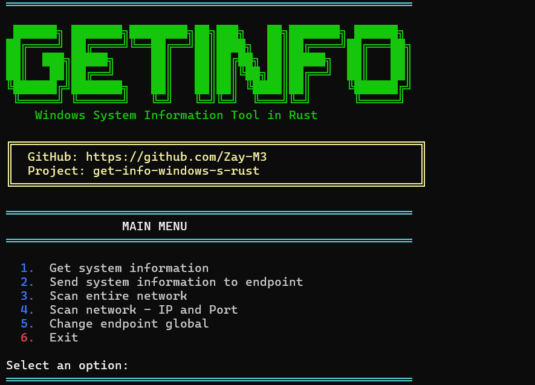

# GetInfo

[](https://opensource.org/licenses/MIT)
[](https://www.rust-lang.org/)
[](https://github.com/Zay-M3/get-info-windows-s-rust/releases)

This is a Rust executable that extracts all relevant operating system information in JSON format. No graphical interfaces or complications, just a .exe that runs, spits out the data and you're done.



## Features

- **System Information Extraction** - Complete OS, CPU, memory, disks, network, users, and processes
- **Network Scanner** - Scan entire network for open ports
- **Targeted Port Scanning** - Scan specific IP and port combinations
- **Beautiful CLI Interface** - Colorful, user-friendly terminal interface
- **JSON Output** - All data in structured JSON format
- **Fast & Lightweight** - Runs in 1-2 seconds, uses ~20MB RAM

## Requirements

- Windows 
- Rust installed 
- Visual Studio Build Tools 

## Quick Start

```powershell
# Compile
cargo build --release

# Run
.\target\release\getinfo_rust.exe

# Or if you're in development
cargo run
```

## Screenshots

### Main Menu
The application features a colorful, easy-to-navigate menu:


### Network Scanner
Scan your network for open ports:


## What Information It Extracts

The executable gets all this and returns it in JSON:

- **Operating System**: Name, version, kernel, hostname, uptime
- **CPU**: All cores with frequency, usage, and vendor
- **Memory**: Total RAM, used, free, SWAP (all in GB and bytes)
- **Disks**: All disks with space, usage, filesystem, type
- **Networks**: Interfaces, MAC, traffic, packets, errors, local IP
- **Users**: Complete list with their groups
- **Processes**: Top 10 by CPU and top 10 by memory with details
- **Applications**: Custom path verification (e.g., C:\YourApp)

## Menu Options

1. **Get System Information** - Extracts all system data and displays it as JSON
2. **Scan Entire Network** - Scans all IPs in your network for open ports (1-10024)
3. **Scan IP & Port** - Scan a specific IP address and port
4. **Exit** - Close the application

## Typical Usage

### Interactive Mode

Just run the executable and use the menu:

```powershell
.\getinfo_rust.exe
```

### Save to File

```powershell
.\getinfo_rust.exe > system-info.json
```

### Process with PowerShell

```powershell
$info = .\getinfo_rust.exe | ConvertFrom-Json
$info.sistema_operativo.hostname
$info.cpu.total_cpus
```

## Network Scanner Features

### Full Network Scan
- Automatically detects all IPs in your local network
- Scans ports 1-10024 on each IP
- Concurrent scanning with semaphore (50 concurrent tasks)
- Shows real-time progress
- Displays only IPs with open ports

### Targeted IP/Port Scan
- Scan specific IP address
- Check if a specific port is open or closed
- Format: `192.168.1.1 -p 80`
- Instant results with color-coded status


## Compilation

### Option 1: Compile Locally

```powershell
# Debug (faster to compile)
cargo build

# Release (optimized)
cargo build --release
```

### Option 2: Download the .exe

If you don't want to compile, download the executable from [releases](https://github.com/Zay-M3/get-info-windows-s-rust/releases).

## Common Issues

### Linker Error (link.exe)

If you see `error: linking with link.exe failed: exit code: 1181`:

1. Install Visual Studio Build Tools
2. Check the "C++ build tools" option during installation
3. Restart the terminal

### JSON Gets Cut Off in Console

Redirect output to a file:

```powershell
.\test-rust.exe > output.json
```

### Doesn't Detect Some Network Interfaces

That's normal. It only shows active interfaces that the system reports.

## Customization

To add custom paths to verify, the application will prompt you interactively, or you can modify the code:

```rust
let paths_to_check = vec![
    "C:\\YourApp",
    "D:\\AnotherFolder",
];
```

Then recompile.

## Dependencies

The project uses:

- `sysinfo`: For system information extraction
- `serde` and `serde_json`: For JSON serialization
- `reqwest`: For HTTP requests
- `tokio`: For async runtime
- `colored`: For terminal colors
- `if-addrs`, `ipnetwork`, `futures`: For network scanning

## Performance

The executable is lightweight:

- Takes ~1-2 seconds to run
- Uses ~20MB of RAM while running
- Resulting JSON weighs ~5-15KB depending on process count
- Network scan depends on network size (typically 30-60 seconds for 254 IPs)

## What This Is For

- Server monitoring without installing heavy agents
- Quick system audits
- Integration with automation scripts
- Historical system state logs
- System change detection
- Base for custom dashboards
- Network security auditing
- Port availability checking

## Contributing

If you find bugs or want to add more information to the JSON, PRs are welcome. I'm not the best Rust programmer in the world, I just wanted it to work and be useful.

## License

This project is licensed under the MIT License - see the [LICENSE](LICENSE) file for details.

## Disclaimer

This isn't intended for critical production use or to replace enterprise monitoring tools. It's for getting quick system information without complications.

---

Made with ❤️ and Rust by [Zay-M3](https://github.com/Zay-M3)
